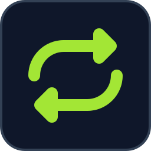
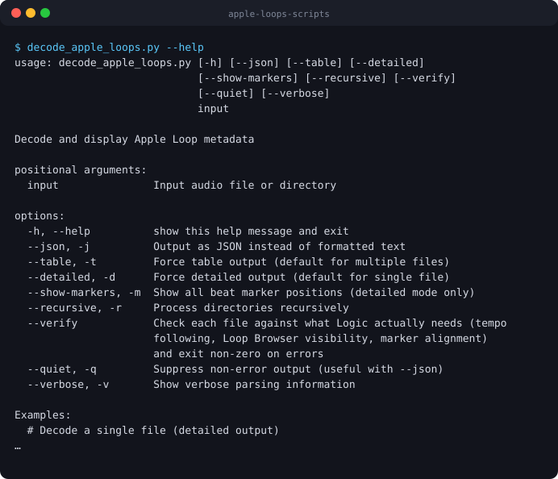

<p align="center">
  
</p>

# Apple Loops Scripts

<!-- BADGES:START -->


[](LICENSE.md)
[](CONTRIBUTING.md)
<!-- BADGES:END -->

## Table of Contents

- [Description](#description)
- [Screenshots](#screenshots)
- [Features](#features)
- [Requirements](#requirements)
- [Installation](#installation)
- [Usage](#usage)
  - [Converting files](#converting-files)
  - [Importing a Splice library](#importing-a-splice-library)
  - [Keeping Logic in step with Splice](#keeping-logic-in-step-with-splice)
  - [Reading and verifying loops](#reading-and-verifying-loops)
  - [Command-line reference](#command-line-reference)
  - [The macOS app](#the-macos-app)
- [Validation Against Apple's Loops](#validation-against-apples-loops)
- [Architecture](#architecture)
  - [Loops, one-shots and how Logic decides](#loops-one-shots-and-how-logic-decides)
  - [Where metadata comes from](#where-metadata-comes-from)
  - [Output format](#output-format)
  - [Project layout](#project-layout)
- [Credits](#credits)
- [Contributing](#contributing)
- [License](#license)

## Description

Python tools for making **Apple Loops**, the tagged CAF files that Logic Pro,
GarageBand and Final Cut Pro show in their Loop Browsers and stretch to the
project's tempo and key. Convert a WAV, a MIDI file or a whole folder; import an
entire Splice library with its real tempo, key and genre; keep Logic in step
with Splice with one double-click; and read any loop's metadata back out to
check that Logic will treat it as a native loop.

Every claim this toolkit makes about the format is tested against the 34,928
loops Apple itself ships with Logic, not against documentation.

## Screenshots

<p align="center">
  
</p>

<p align="center"><em>The decoder's command-line help, captured from a real run.</em></p>

The SwiftUI app in `macos-app/` has no screenshot yet, because capturing one
needs Xcode on a Mac.

## Features

**Converter** (`convert_to_apple_loops.py`)

- Audio **and** MIDI to Apple Loop CAF, one file or a whole folder tree
- **Splice integration**: the real tempo, key, genre, tags and loop or one-shot
  status from the Splice desktop app's own `sounds.db`
- **Loops and one-shots handled differently**: a one-shot gets no beat count and
  no beat markers, so Logic never time-stretches a single hit
- **Metadata from filenames and MIDI content** when there is no database
- **Beat counts that snap to bar lines**, so a decay tail does not become a
  wrong tempo
- **Beat markers on detected transients**, as sparse or dense as the audio
  really is, like Apple's own
- **Lossless ALAC by default**, or AAC
- **A dry run** that shows what each file would become

**Decoder** (`decode_apple_loops.py`)

- Every metadata field Logic uses, from modern CAF, legacy AIFF and MIDI loops
- MIDI tracks, notes and programs, and beat-marker positions
- **`--verify`**, which checks a file against what Logic actually needs and
  exits non-zero if it will not behave as a native loop
- Table, detailed or JSON output

**Sync** (`scripts/sync_splice_to_apple_loops.py`)

- Converts only what Splice downloaded since the last run, with a
  **double-clickable launcher** for macOS
- Safe to run repeatedly: no sample is ever converted twice or overwritten by
  another

**Validation** (`scripts/validate-against-apple-loops.py`)

- Checks the toolkit's vocabulary, beat counts, round trips and verifier against
  the loops Apple ships

## Requirements

- **Python 3.9** or newer
- **macOS** for converting **audio**, which uses Apple's `afconvert`. MIDI
  conversion is pure Python and runs anywhere, as does the test suite.
- Python packages from `requirements.txt`: `librosa`, `soundfile`, `numpy`, and
  `mido`, which improves MIDI support
- **Logic Pro** installed, only for `scripts/validate-against-apple-loops.py`,
  which reads Apple's own loops
- The **Splice desktop app**, only for the Splice features
- **Xcode 14+** on **macOS 12+**, only to build the SwiftUI app

## Installation

```bash
git clone https://github.com/geoffmyers/apple-loops-scripts.git
cd apple-loops-scripts
pip install -r requirements.txt

# To run the test suite as well
pip install -r requirements-dev.txt
python3 -m pytest
```

## Usage

Converted loops go to `~/Library/Audio/Apple Loops/User Loops/` unless you say
otherwise. Logic indexes that folder the next time it starts, or you can drag a
folder onto the Loop Browser.

### Converting files

```bash
# One file, metadata from its name
./convert_to_apple_loops.py input.wav

# With explicit metadata
./convert_to_apple_loops.py input.wav -o output.caf \
    --tempo 120 --key Am --category Bass --genre "Electronic/Dance" \
    --descriptors "Grooving,Clean"

# A MIDI file
./convert_to_apple_loops.py input.mid --category Keyboards

# A whole folder: audio and MIDI, or one kind only
./convert_to_apple_loops.py /path/to/loops/
./convert_to_apple_loops.py /path/to/loops/ --audio-only
./convert_to_apple_loops.py /path/to/loops/ --midi-only

# Preview without writing anything
./convert_to_apple_loops.py /path/to/loops/ --dry-run

# Lossy AAC instead of ALAC
./convert_to_apple_loops.py input.wav --lossy --bitrate 256000
```

Categories and genres must be values Apple uses, or the Loop Browser will not
show the loop. The accepted lists are in `apple_loops_vocabulary.py`.

### Importing a Splice library

This is the case the toolkit is built around. Splice keeps a SQLite database of
every sample it has downloaded, and each row already holds the sample's real
BPM, key, genre, tags and whether it is a loop or a one-shot. Reading it turns
every value from a filename guess into a fact.

```bash
# Preview: what would each file become?
./convert_to_apple_loops.py ~/Splice --dry-run --splice-db

# Convert the whole library
./convert_to_apple_loops.py ~/Splice \
    --splice-db \
    --output-dir "$HOME/Library/Audio/Apple Loops/User Loops/SingleFiles"

# Check the result behaves natively
./decode_apple_loops.py "$HOME/Library/Audio/Apple Loops/User Loops/SingleFiles" \
    --verify --recursive
```

`--splice-db` with no value searches the usual locations. If it finds nothing,
export a copy from the app (**Settings → Download logs**), take
`users/default/<username>/sounds.db` out of the zip, and pass its path. Add
`--splice-only` to convert *only* the files Splice knows about.

| Field | Without `--splice-db` | With it |
|---|---|---|
| Tempo | guessed from digits in the filename | the `bpm` column |
| Key and scale | guessed from a suffix like `Am` | `audio_key` and `chord_type` |
| Genre | keyword match on the filename | the `genre` column |
| Category | keyword match on the filename | `tags`, most specific first, then the filename |
| **Loop or one-shot** | guessed from the folder name | the `sample_type` column |

That last row matters most. A one-shot treated as a loop is written with beat
markers, and Logic then stretches it to the project tempo, so a kick drum stops
being that kick drum. A Splice library is mostly one-shots.

### Keeping Logic in step with Splice

Double-click `scripts/Update Apple Loops from Splice.command`. It converts
everything Splice has downloaded since the last run into
`~/Library/Audio/Apple Loops/User Loops/Splice/` and leaves finished work alone.
The first run builds its own Python environment, which takes a minute or two;
after that, a sync with nothing new takes about two seconds.
`Rebuild All Apple Loops from Splice.command` reconverts everything, which is
worth doing once after updating the toolkit.

From a terminal:

```bash
python3 scripts/sync_splice_to_apple_loops.py --dry-run   # say what would happen
python3 scripts/sync_splice_to_apple_loops.py             # sync what is new
python3 scripts/sync_splice_to_apple_loops.py --rebuild   # reconvert everything
```

It reads from `~/Splice/sounds` by default (`--source` to change it), writes to
the folder above (`--output`), and never writes to your Splice folder.

The converter gives a taken output name a suffix (`Kick_01_2.caf`), which is
right when two packs both contain a `Kick_01` and disastrous on a re-run, where
every sync would duplicate the library. So the sync keeps a manifest in
`~/Library/Application Support/apple-loops-sync/`, keyed by source path, and
decides:

| State | What happens |
|---|---|
| New source | Converted |
| Source changed since the last sync | Reconverted in place |
| Output deleted by hand | Rebuilt |
| Already converted, unchanged | Skipped |
| A `.caf` already there from an earlier run | **Adopted**, not duplicated |
| A `.caf` with no matching source | Left alone |

**No output name is ever claimed twice**, even when two names differ only in
case, which macOS treats as the same file. Before that check existed, 4 of 1,812
files on a real run had one sample's audio silently overwrite another's; a later
sync repairs such a library automatically.

### Reading and verifying loops

```bash
./decode_apple_loops.py loop.caf                  # everything, in detail
./decode_apple_loops.py loop.mid                  # a MIDI file
./decode_apple_loops.py loop.caf --json           # machine-readable
./decode_apple_loops.py loop.caf --show-markers   # every beat marker
./decode_apple_loops.py /path/to/loops/ --recursive
./decode_apple_loops.py /path/to/loops/ --verify --recursive
```

`--verify` reports each problem as an error or a warning and exits non-zero
if any file has an error. Its thresholds come from Apple's own library, so it
does not flag what Apple itself ships.

| Check | Severity | Why it matters |
|---|---|---|
| No Apple Loop metadata at all | warning | A plain audio file; the Loop Browser will not index it |
| A beat count but no beat markers | error | The loop will not follow the project tempo |
| Beat markers but no beat count | warning | Logic cannot derive a tempo |
| Derived tempo outside 20–400 BPM | error | The beat count is wrong; Apple's own loops run from 21 to 360 BPM |
| A category Apple does not use | error | No Loop Browser filter will show it |
| A genre Apple does not use | error | As above |
| A subcategory Apple does not use | warning | |
| A key signature on a percussive loop | warning | Against Apple's own rule |
| A key type with no key signature | warning | |

Two things are deliberately **not** checked, because Apple's own loops do them:
where the last beat marker falls (Apple places markers on transients, so the
last lands anywhere from 0.14× to 8.8× the audio length), and whether the info
chunk has a genre (only 21.6% of Apple's loops carry one).

### Command-line reference

**`convert_to_apple_loops.py [options] input`**

| Option | What it does |
|---|---|
| `-o, --output` | Output file, for a single input |
| `--output-dir` | Output folder (default `~/Library/Audio/Apple Loops/User Loops/`) |
| `--tempo`, `--key`, `--time-signature`, `--beat-count` | Override the musical metadata; the time signature defaults to 4/4 |
| `--category`, `--subcategory`, `--genre`, `--descriptors` | Override the browser metadata; descriptors are comma-separated |
| `--splice-db [PATH]` | Read metadata from Splice's `sounds.db`; with no path, find it |
| `--splice-only` | Skip files `sounds.db` does not know |
| `--one-shot`, `--loop` | Treat every input as a one-shot, or as a loop |
| `--lossy`, `--bitrate` | AAC instead of ALAC, and its bitrate (default 256000) |
| `--recursive`, `--no-recursive` | Include subfolders (the default), or not |
| `--preserve-structure` | Mirror the input folder structure in the output |
| `--overwrite` | Replace a same-named `.caf` instead of adding a suffix |
| `--extensions` | Comma-separated extensions to process |
| `--audio-only`, `--midi-only` | Process one kind of file |
| `-t, --table`, `-d, --detailed` | Force table or detailed output |
| `--dry-run` | Show what would happen without converting |
| `-v, --verbose` | More output |
| `--no-transient-detection` | Place markers on an even grid, four per beat, instead of on detected transients |
| `--onset-threshold` | Transient detection threshold, 0.0–1.0 (default 0.3) |
| `--onset-hop-length` | Hop length for transient detection (default 512) |
| `--min-markers-per-beat` | Pad sparse marker sets to this density; off by default, as in Apple's loops |

Accepted inputs: `.wav`, `.aif`, `.aiff`, `.mp3`, `.m4a`, `.aac`, `.flac`,
`.alac`, `.caf`, `.ogg`, `.wma`, `.mid`, `.midi` and `.smf`.

**`decode_apple_loops.py [options] input`**

| Option | What it does |
|---|---|
| `-j, --json` | JSON output |
| `-t, --table`, `-d, --detailed` | Force table or detailed output |
| `-r, --recursive` | Include subfolders |
| `-m, --show-markers` | List every beat marker (detailed output only) |
| `--verify` | Check each file as described above |
| `-q, --quiet` | Only errors; useful with `--json` |
| `-v, --verbose` | Parsing details |

### The macOS app

`macos-app/` holds a SwiftUI front end that runs `convert_to_apple_loops.py`
for you.

```bash
open macos-app/AppleLoopsConverter.xcodeproj
# or
xcodebuild -project macos-app/AppleLoopsConverter.xcodeproj -scheme AppleLoopsConverter build
```

Set the path to the Python script in the app's settings, or let it find the
script. **The app is behind the command line**: it does not pass `--splice-db`,
`--one-shot`/`--loop` or `--min-markers-per-beat`, so it still produces the
older output. Use the scripts or the `.command` launchers for Splice libraries.

## Validation Against Apple's Loops

`scripts/validate-against-apple-loops.py` checks the toolkit against the
**34,928 loops Apple ships with Logic**, the only real authority on the format.
These are the results recorded when the checks were run:

| Check | Result |
|---|---|
| Strip a real Apple Loop to bare WAV, rebuild it, compare every metadata field | **400/400 exact match** |
| ALAC audio integrity through the conversion | **214/214 bit-identical PCM** |
| Recover Apple's own beat count from its duration and a rounded tempo | **100%** of 32,274 loops |
| The same, with a simulated 0.6-beat decay tail | **98.1%**, against 83.2% for plain rounding |
| `--verify` false positives on Apple's own loops | **0.12%** (97.5% report no findings at all) |
| Marker density against Apple's | 11.1% of loops sparser than one marker per beat, against Apple's 11.9%; no gaps under 10 ms |
| A real 1,725-sample Splice library, converted and verified | **1,812/1,812 clean, no findings** |

Run it yourself on a Mac with Logic installed:

```bash
python3 scripts/validate-against-apple-loops.py --mode all --limit 3000
```

Its modes are `vocabulary` (Apple's real value lists), `beatcount` (can Apple's
beat counts be recovered?), `roundtrip` (strip and rebuild real loops),
`calibrate` (the distributions `--verify`'s thresholds come from) and `verifier`
(what `--verify` says about Apple's own files, where any error is a false
positive). `scripts/splice-tag-coverage.py` measures how much of a Splice
library's tag vocabulary maps onto Apple's closed lists.

This is how the toolkit found its own mistakes. The category, genre and
descriptor lists used to be written by hand, and the census showed them wrong
in both directions: 13 genres listed where Apple ships 30, and invented values
such as `Hi-Hat` where Apple writes `Hi-hat`. They are now generated from the
census in `reference/apple-loops-shipped-vocabulary.json`, and a test keeps them
equal to it. The same work took `--verify` from a 12.6% false-positive rate on
Apple's files to 0.12%.

## Architecture

### Loops, one-shots and how Logic decides

Apple Loops store **no tempo field**. Logic works it out as
`beat_count × 60 ÷ duration`, and only time-stretches files that carry a beat
markers chunk. So:

- A **loop** gets a beat count and beat markers, and follows the project tempo.
  Its key signature makes it follow the project key.
- A **one-shot** gets neither, and plays at its recorded pitch and length.

Because tempo is derived from the beat count, a beat count that is off by one is
a tempo that is off by one beat. Derived beat counts are therefore snapped to
musical bar lengths, but only when the gap is less than a beat, which is what a
decay tail looks like. A file genuinely two beats off a bar line keeps its odd
length. Use `--one-shot` or `--loop` when you know better than the detection.

### Where metadata comes from

Each file's metadata is resolved in one place, `AppleLoopConverter.metadata_for()`,
so a dry run and a real conversion always agree:

1. **Splice's `sounds.db`**, with `--splice-db`, when it has a row for the file.
   If none of the sample's tags maps to an Apple category, the category comes
   from the filename instead.
2. **Otherwise, the filename and, for MIDI files, the file's own events**:
   `_120bpm` or `120BPM` for tempo, `_Am` or `A_minor` for key, instrument and
   genre keywords such as `bass`, `synth`, `funk` or `jazz`, and MIDI tempo, key
   signature, time signature and program changes (General MIDI programs map to
   Apple categories).
3. **Command-line options** such as `--tempo` or `--category` are applied last
   and win.

### Output format

| | Audio loops | MIDI loops |
|---|---|---|
| Container | CAF with ALAC (default) or AAC audio | CAF with the Standard MIDI File in a `midi` chunk |
| Metadata | Apple Loop metadata UUID chunk | The same |
| Beat markers | UUID chunk, on detected transients or an even grid | UUID chunk, on the beat |
| Spotlight | `info` chunk with the genre | The same |

[APPLE_LOOPS_FORMAT.md](APPLE_LOOPS_FORMAT.md) specifies the CAF structure, the
UUID chunks, marker generation and the valid metadata values in full.

### Project layout

```
apple-loops-scripts/
├── convert_to_apple_loops.py        # converter (audio + MIDI)
├── decode_apple_loops.py            # decoder and verifier
├── splice_db.py                     # read-only reader for Splice's sounds.db
├── apple_loops_vocabulary.py        # Apple's closed category, genre and descriptor lists
├── APPLE_LOOPS_FORMAT.md            # format specification
├── reference/
│   └── apple-loops-shipped-vocabulary.json   # the census the vocabulary is generated from
├── scripts/
│   ├── sync_splice_to_apple_loops.py
│   ├── Update Apple Loops from Splice.command
│   ├── Rebuild All Apple Loops from Splice.command
│   ├── validate-against-apple-loops.py
│   └── splice-tag-coverage.py
├── tests/                           # pytest suite; runs without macOS
├── macos-app/                       # SwiftUI front end
├── requirements.txt
└── requirements-dev.txt
```

See [ARCHITECTURE.md](ARCHITECTURE.md) for more detail.

## Credits

- Audio analysis by [librosa](https://librosa.org/) and
  [soundfile](https://python-soundfile.readthedocs.io/), on
  [NumPy](https://numpy.org/); MIDI handling by
  [mido](https://mido.readthedocs.io/); tests by [pytest](https://docs.pytest.org/).
- Audio encoding by Apple's `afconvert`, part of macOS.
- Splice metadata is read from the database the
  [Splice](https://splice.com/) desktop app keeps. This project is not
  affiliated with Splice.
- Apple Loops, Logic Pro, GarageBand and Final Cut Pro are trademarks of Apple
  Inc. This project is not affiliated with or endorsed by Apple.
- The README icon is the [Font Awesome](https://fontawesome.com/) `repeat` glyph,
  used under [CC BY 4.0](https://creativecommons.org/licenses/by/4.0/).

Written by Geoff Myers.

## Contributing

Bug reports and pull requests are welcome. See [CONTRIBUTING.md](CONTRIBUTING.md)
for setup, checks and how this repository is published. Before changing
metadata values, thresholds or what counts as "correct", run
`scripts/validate-against-apple-loops.py`.

## License

This program is free software: you can redistribute it and/or modify it under
the terms of the GNU General Public License as published by the Free Software
Foundation, either version 3 of the License, or (at your option) any later
version.

This program is distributed in the hope that it will be useful, but WITHOUT ANY
WARRANTY; without even the implied warranty of MERCHANTABILITY or FITNESS FOR A
PARTICULAR PURPOSE. See [LICENSE.md](LICENSE.md) for the full text of the GNU
General Public License.

SPDX-License-Identifier: `GPL-3.0-or-later`
